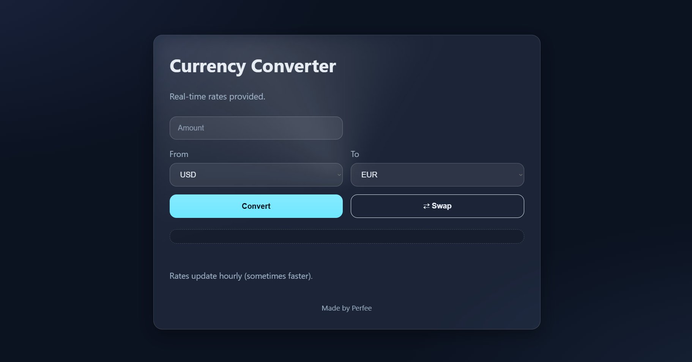

# Currency Converter

A simple currency converter built with **HTML**, **CSS**, and **JavaScript** 
This use the free [open.er-api.com](https://open.er-api.com/) API to fetch real-time rates, includes offline caching

## Features
-  Convert between 150+ currencies
-  Real-time exchange rates
-  Offline caching (12-hour cache in `localStorage`)
-  Accessible form labels & keyboard support
-  Works entirely client-side (no backend needed)

## Screenshot


## Live Demo
[**View Live on GitHub Pages**]( https://perfee123.github.io/currency-converter/)

## Languages
- **HTML5** — structure
- **CSS3** — responsive & theme-aware UI
- **JavaScript (Vanilla)** — fetch API, caching, DOM manipulation
- **[open.er-api.com](https://open.er-api.com/)** — free exchange rate API


### 1. Clone the Repository
```bash
git clone  https://perfee123.github.io/currency-converter/git
cd currency-converter
